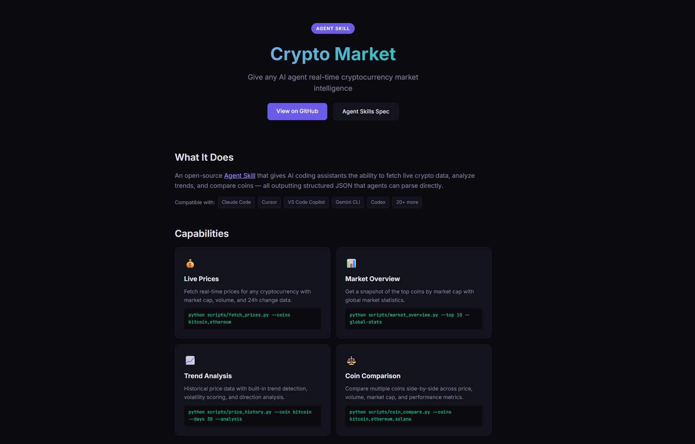

# Crypto Market Agent Skill

An [Agent Skill](https://agentskills.io) that gives any AI coding assistant real-time cryptocurrency market intelligence. Built for the [Spring into AI Competition](https://advisoryhour.substack.com/p/spring-into-ai-competition-rules) — Week 2: Tooling for AI Tools.

## Live Demo

**Hosted App:** [https://crypto-agent-skill.vercel.app](https://crypto-agent-skill.vercel.app)

## Screenshot



## What It Does

This skill gives AI agents (Claude Code, Cursor, VS Code Copilot, Gemini CLI, Codex, and 20+ more) the ability to:

- **Fetch live prices** for any cryptocurrency with market cap, volume, and 24h change
- **Get market overviews** of top coins with global market statistics
- **Analyze price trends** with built-in direction detection, volatility scoring, and historical data
- **Compare coins** side-by-side across all key metrics

All outputs are structured JSON — designed for AI agents to parse, not humans to read.

## How It Works

This project follows the open [Agent Skills](https://agentskills.io) specification:

1. **Discovery** — The agent reads the `SKILL.md` metadata at startup and knows this skill handles crypto-related queries
2. **Activation** — When a user asks about crypto prices, market data, or coin comparisons, the agent loads the full skill instructions
3. **Execution** — The agent runs the appropriate Python script and returns structured JSON data

## Setup

### Prerequisites

- Python 3.8+
- Internet access (uses [CoinGecko](https://www.coingecko.com/en/api) free API — no key required)

### Install

```bash
git clone https://github.com/JStrait515/crypto-agent-skill.git
cd crypto-agent-skill
pip install -r crypto-market/scripts/requirements.txt
```

### Add to Your AI Agent

Copy the `crypto-market/` folder into your agent's skills directory:

- **Claude Code:** `~/.claude/skills/`
- **Cursor:** `.cursor/skills/`
- **Other agents:** See [Agent Skills docs](https://agentskills.io/integrate-skills)

Then just ask your agent about crypto:

```
"What's the current price of Bitcoin?"
"Give me a market overview of the top 10 coins"
"How has Ethereum performed over the last 30 days?"
"Compare BTC, ETH, and SOL"
```

## Scripts

| Script | Description |
|--------|-------------|
| `fetch_prices.py` | Get current prices, market cap, volume, and 24h change |
| `market_overview.py` | Top N coins by market cap with global stats |
| `price_history.py` | Historical price data with trend analysis |
| `coin_compare.py` | Compare multiple coins side-by-side |

All scripts support `--help` for full usage details.

### Quick Examples

```bash
# Current prices
python crypto-market/scripts/fetch_prices.py --coins bitcoin,ethereum --include-24h-change

# Top 10 coins + global stats
python crypto-market/scripts/market_overview.py --top 10 --global-stats

# 30-day trend analysis
python crypto-market/scripts/price_history.py --coin bitcoin --days 30 --analysis

# Side-by-side comparison
python crypto-market/scripts/coin_compare.py --coins bitcoin,ethereum,solana

# Search for a coin ID
python crypto-market/scripts/fetch_prices.py --list-coins avalanche
```

## Tech Stack

- **Format:** [Agent Skills](https://agentskills.io) (open standard by Anthropic)
- **API:** [CoinGecko v3](https://www.coingecko.com/en/api/documentation) (free, no key needed)
- **Language:** Python 3.8+
- **Hosting:** Vercel (demo page)

## License

MIT
